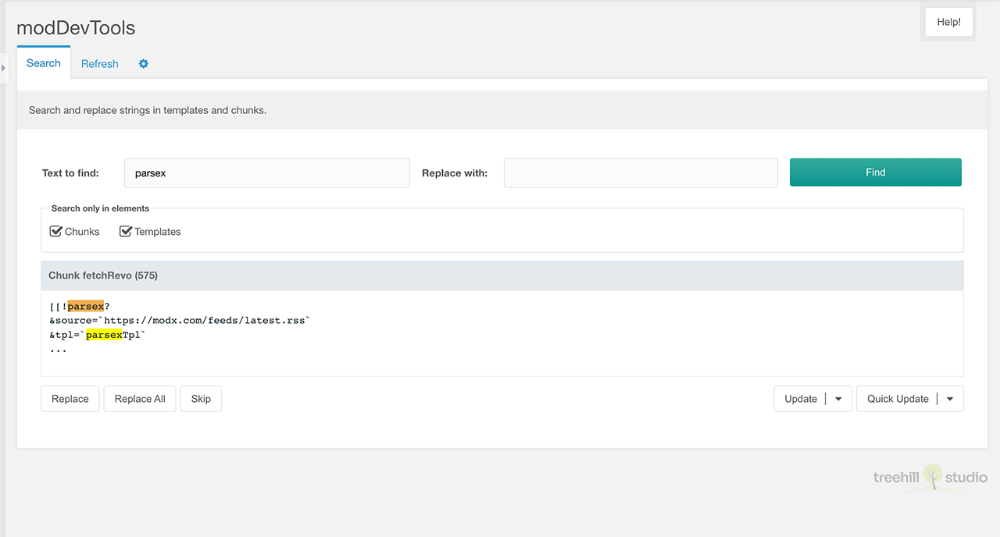
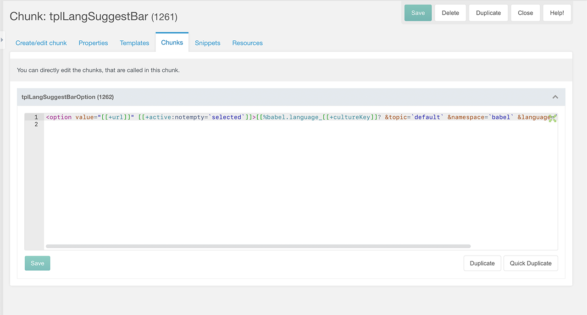
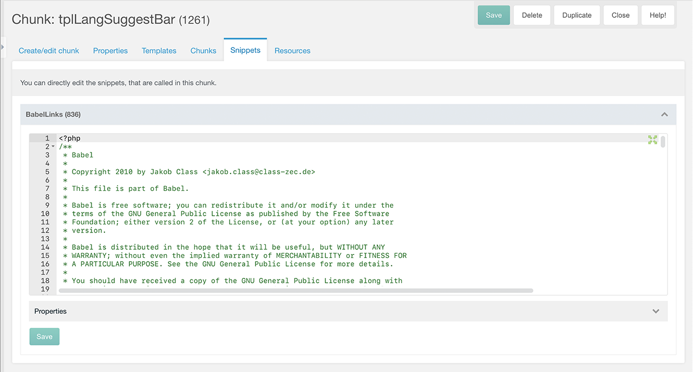
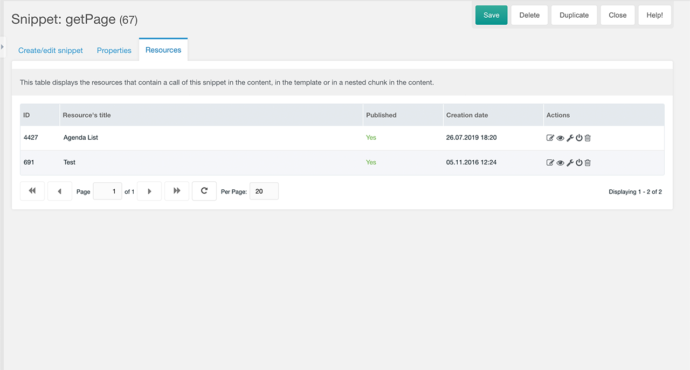
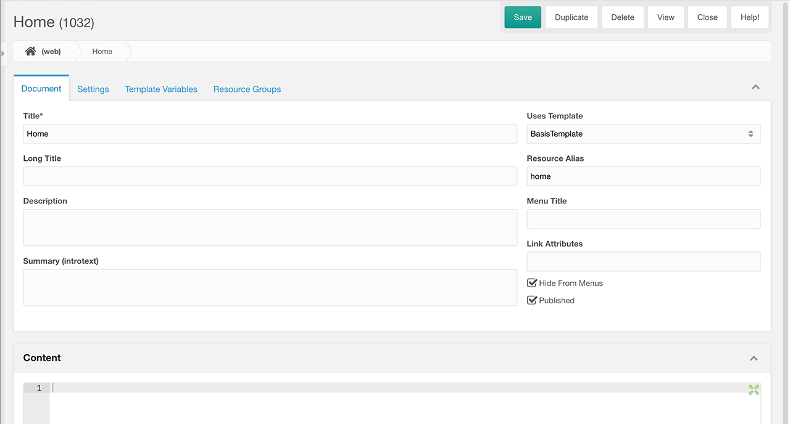

## Introduction

This MODX Extra adds some nice development features to the MODX manager.

## Search and replace

The Extras menu contains a new entry modDevTools, which opens a separate manager
page. page opens. It allows you to search and replace text in the contents of
chunks and templates.

Enter the string you want to search for and click the `Search` button. Below the
search field there are checkboxes to limit the search to specific elements
(chunks and templates).

After a successful search, the code of all found elements is displayed, with the
search text highlighted. A replacement must be made for each found element
individually. For this purpose there are three buttons below the code block:
`Replace`, `Replace all` and `Skip`.

The `Replace` button replaces the search string at the position where the cursor
is located (dark highlighting) with the replacement string. The `Skip` button
moves the cursor to the next match. The `Replace All` button replaces all search
strings in the code of the current element.

There are also two other buttons on the right side below the code element:
`Update` and `Quick Update`. When you click the `Update` button, the element's edit
page opens. Clicking the `Quick Update` button opens a modal window where you can
quickly edit the element.

## Edit linked elements

The editing page of chunks, snippets and templates contains some additional
tabs. These tabs allow you to edit the content of linked (used) elements on the
current page. The following element pages contain the tabs listed below.

### Chunk Page
- `Templates Tab` - The code of templates in which the currently edited chunk is called. If you have installed Ace, you, the chunk is highlighted in the template code.
- `Chunks Tab` - The code of chunks that are called in the currently edited chunk. Snippet parameters specified in the call and default snippet parameters related to chunks also appear here.
- `Snippets Tab` - The code of snippets that are called in the currently edited chunk. Below the snipped code you can expand the snippet properties with default values and descriptions.
- `Resources Tab` - List of resources that are included in the template or whose content is called in some way in this chunk. You can go to the edited resource, open it in the browser, quickly change the template or publishing status or delete it to the trash.

### Template Page
- `Chunks Tab` - The code of chunks that are called in the currently edited template.
- `Snippets Tab` - The code of snippets that are called in the currently edited template.
- `Resources Tab` - A list of resources with the currently edited template.

### Snippet Page
- `Resources Tab` - A list of resources where the currently edited snippet is called.

#### Example Chunks Tab

#### Example Snippets Tab

#### Example Resources Tab

## Linked Breadcrumb Path

On the Edit Resources page, a linked breadcrumb path is inserted title below the
page title. You can click any section of this breadcrumb path to edit the
clicked resource. There are two system settings for changing parts of this
breadcrumb path. This breadcrumb path is not shown in MODX 3.x, since this
version uses is an own breadcrumb path.

## User permissions

modDevTools uses standard user access permissions:

| Permission                 | Description                                                                                                   |
|----------------------------|---------------------------------------------------------------------------------------------------------------|
| view_chunk & view_template | To open the `Search Page` to search and replace strings.                                                      |
| save_chunk                 | For changing strings in chunks in the `Chunks Tab` and for string replacement in chunks in the `Search Page`. |
| save_snippet               | For changing strings in snippets in the `Snippets Tab`.                                                       |
| save_template              | For changing strings in templates in the `Templates Tab` and for string replacement in the `Search Page`.     |
| view_chunk                 | To display the `Chunks Tab`                                                                                   |
| view_template              | To display the `Templates Tab`                                                                                |
| view_snippet               | To display the `Snippets Tab`                                                                                 |
| resource_tree              | To display the `Resources Tab`                                                                                |
| edit_document              | To display an edit icon in the table on the `Resources Tab`                                                   |
| save_document              | To change the template resource in the table on the `Resources Tab`                                           |
| publish_document           | To change the publication status in the table on the `Resources Tab`                                          |
| delete_document            | To remove the resource to the recycle bin in the table on the `Resources Tab`                                 |

**Attention:** resource groups are currently not supported, i.e. if a resource
group is hidden from site managers in the mgr context, they can still see their
resources it in the resource list.

## System Settings

modDevTools uses the following system settings in the `moddevtools` namespace
and  in an additional tab on the custom manager page:

| Setting                 | Description                                  | Default |
|-------------------------|----------------------------------------------|---------|
| Breadcrumb Limit        | Limit of displayed breadcrumb entries.       | 3       |
| Debug                   | Log debug information in the MODX error log. | No      |
| Show Breadcrumb Context | Show the context key in the breadcrumb path. | No      |
